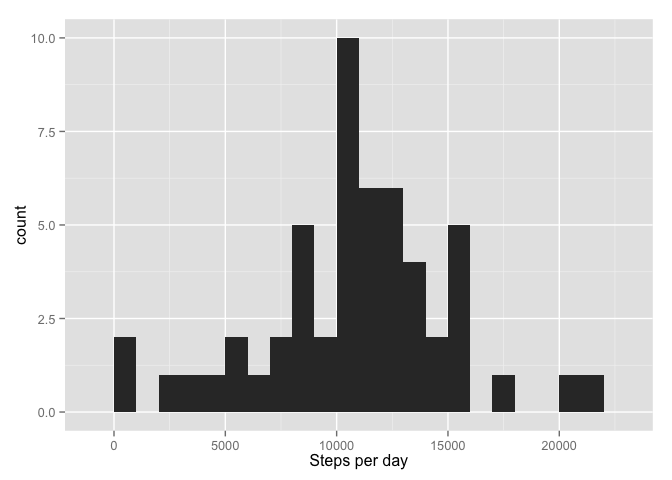
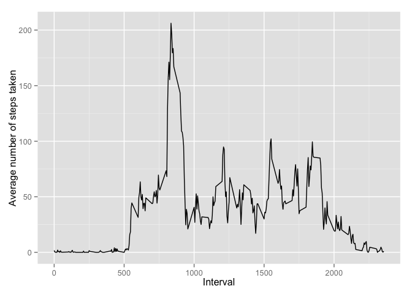

# Reproducible Research: Peer Assessment 1


## Loading and preprocessing the data

```r
library(ggplot2)

# Load the data
setwd("~/R/RepData_PeerAssessment1")
data <- read.csv(unz("activity.zip", "activity.csv"))

# Process/transform the data (if necessary) into a format suitable for your analysis
data$date <- as.Date(data$date)
```

## What is mean total number of steps taken per day?

```r
# For this part of the assignment, you can ignore the missing values in the dataset
p <- na.omit(data)

# Calculate the total number of steps taken per day
steps_per_day <- aggregate(steps ~ date, data=p, FUN = sum)

# Make a histogram of the total number of steps taken each day
qplot(steps_per_day$steps,
      geom="histogram",
      binwidth = 1000,
      xlab = "Steps per day",  
      fill=I("blue"),
      alpha=I(.8)
      )
```

 

```r
# Calculate and report the mean of the total number of steps taken per day
mean(steps_per_day$steps)
```

```
## [1] 10766.19
```

```r
# Calculate and report the median of the total number of steps taken per day
median(steps_per_day$steps)
```

```
## [1] 10765
```

## What is the average daily activity pattern?

```r
# Make a time series plot (i.e. type = "l") of the 5-minute interval (x-axis) and the average number of steps taken, averaged across all days (y-axis)
average_steps <- aggregate(steps ~ interval, data=p, FUN = mean)

qplot(interval,
      steps,
      data = average_steps,
      geom="line",
      xlab = "Interval",
      ylab = "Average number of steps taken"
      )
```

 

## Imputing missing values


## Are there differences in activity patterns between weekdays and weekends?
